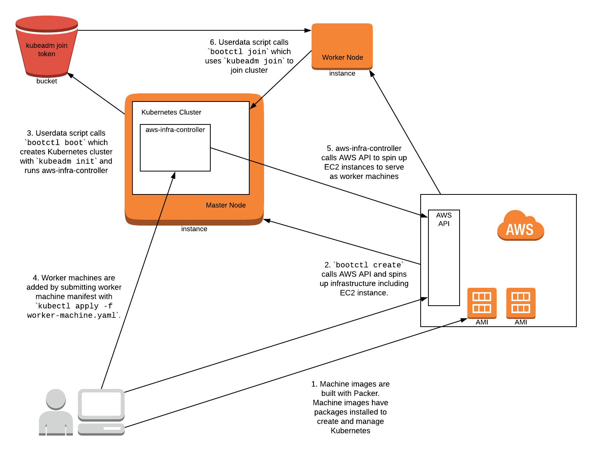

# aws-infra-controller

The aws-infra-controller manages the AWS infrastructure of your Kubernetes cluster for you.

## How It Works

## Status

This project is a proof-of-concept work in progress.  The instructions below will spin up a single-node Kubernetes cluster in AWS and allow you to add worker machines but more useful infra management functionality is still in development.

Note: the IAM policies and S3 bucket are not secure.  Do not use for anything besides testing and dev.

## Related Work

The [Cluster API Provider AWS](https://github.com/kubernetes-sigs/cluster-api-provider-aws) also uses Kuberenetes custom resources to manage the AWS infrastructure for your cluster.  The main difference is that you need a cluster in order to deploy a cluster which creates a dependency on minikube or kind.

This project does not address multi-cluster concerns at all and so is narrower in scope.

## Prerequisites

* [go](https://golang.org/)
* [docker](https://docs.docker.com/install/)
* [packer](https://www.packer.io/)
* have an AWS account with credentials for API access

## Put your AWS security credentials in your environment

    $ export AWS_ACCESS_KEY_ID=[your access key ID]
    $ export AWS_SECRET_ACCESS_KEY=[your secret access key]
    $ export AWS_REGION=[your preferred AWS region]

## Build a Docker Image (optional)

If you'd like to use your own build of the aws-infra-controller:

    $ export IMG=[your image name]  # e.g. quay.io/myrepo/aws-infra-controller:test
    $ make docker-build
    $ make docker-push

Now put your image name in the manifest for the aws-infra-controller deployment at `machine_images/boot/ubuntu/aws-infra-controller.yaml`.

## Build Machine Images

Build the machine images for the bootstrap master and worker nodes.  Take note of each AMI ID that packer gives you.

    $ make boot-machine-image
    $ make worker-machine-image

## Edit Machine Configs

Set the following in `config/samples/boot-master-machine.yaml`:

* `spec.ami`: add the AMI from the boot machine image you built in the previous section
* `spec.keyName`: the name of a key pair in AWS you can use.

Set the following in `config/samples/worker-machine.yaml`:

* `spec.ami`: add the AMI from the worker machine image you built in the previous section
* `spec.keyName`: the name of a key pair in AWS you can use.

## Edit Cluster Config

Set the following in `config/samples/cluster.yaml`:

* `metadata.name`: arbitrary name you will recognize for your cluster
* `spec.region`: your preferred AWS region.  Use the same region you put in the `AWS_REGION` environment variable.

## Build bootctl Utility

    $ make bootctl

## Install a Cluster

Run the create command with cluster and machine flags, write output to an inventory config in your home directory:

    $ ./bootctl create \
        -c config/samples/cluster.yaml \
        -m config/samples/boot-master-machine.yaml \
        > ~/.aws-infra-controller-inventory.json

Note: do not overwrite or delete the `~/.aws-infra-controller-inventory.json` file until you have deleted your cluster.  The `destroy` command references it to determine which infrastructure to tear down.

## Connect to Cluster

Note: the following steps will be streamlined when functionality is added to retrieve a kubeconfig for interaction with the cluster.  It will elliminate the need to connect via ssh.

Wait a couple of minutes for the EC2 instance to spin up and the Kubernetes cluster to initialize.

Get the master node's IP address from AWS.  Then copy some configs to the EC2 instance.

    $ scp ~/.aws-infra-controller-inventory.json ubuntu@[ip address]:~/aws-infra-controller-inventory.json
    $ scp config/samples/worker-machine.yaml ubuntu@[ip address]:~/

Connect to your EC2 instance:

    $ ssh ubuntu@[ip address]

View the cluster's node.  Will be just the master node:

    $ kubectl get nodes

Add the cluster's inventory:

    $ kubectl apply -f aws-infra-controller-inventory.json

Add a worker node:

    $ kubectl apply -f worker-machine.yaml

Allow a couple of minutes for the worker node to spin up and attach.  There should be a worker node as well now:

    $ kubectl get nodes

Add a second worker node:

    $ kubectl edit machine worker  # changed the `replicas` to 2

That will join a second worker to your cluster.

## Destroy the Cluster

Disconnect from the EC2 instance.

Use the AWS CLI or console to terminate the worker instance/s.

Run the destroy command and reference the inventory file generated by the create command.  This will destroy all other infrastructure created by `bootctl create`.

    $ ./bootctl destroy \
        -i ~/.aws-infra-controller-inventory.json

## TODO
* update inventory when provisioning new instances
    - modify `bootctl delete` to use updated inventory structure
* add worker scale-down functionality
* put kubeconfig on S3 bucket with `bootctl boot`
* add ELB for master/s
* implement kubeadm config - pass to `bootctl create`
    - add aws cloud provider
* retrieve kubecconfig with `bootctl create`
* load inventory resource with `bootctl create`

