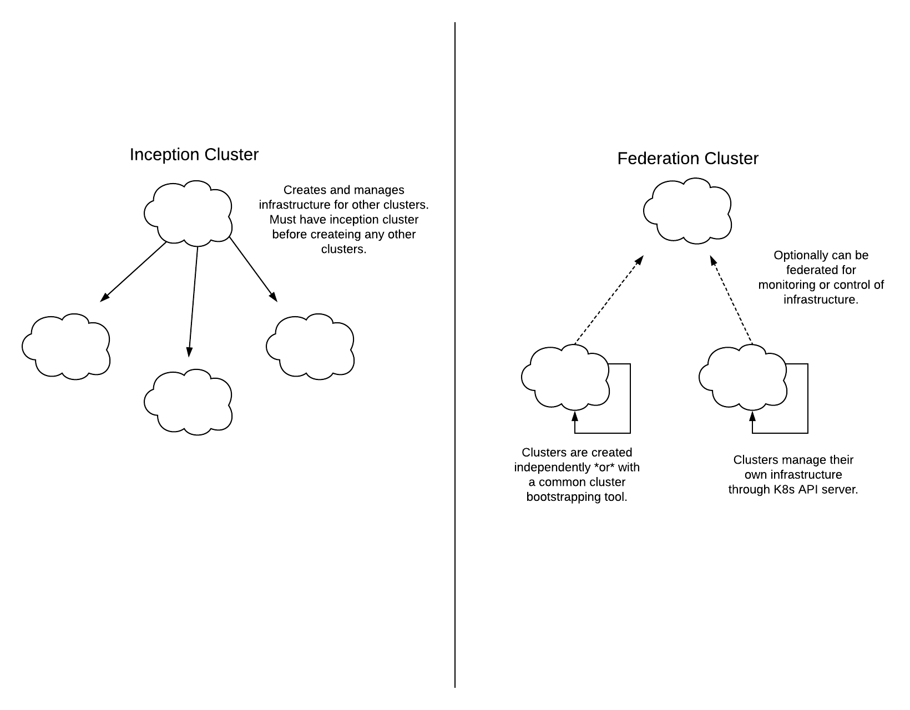

# Design Goals

## Primary Goal

Manage a cluster's infrastructure through the Kubernetes API.  Do just that and do it well.

## Secondary Objective

Provide a means to get from zero to a cluster that meets the primary goal.  Do as little as possible to get there.  Make that piece as simple and robust as possible.

Just get to a place where you're managing infrastructure with Kuberetes and then make that experience wonderful.

## Design Characteristics

* Narrow Scope
* Simple & Robust
* Configurable
* Immutable
* Composable

### Narrow Scope

Extending the Kubernetes API with Cluster and Machine resources is an excellent idea.  Do only that and the bare minimum of things that get you there.  Once you get there, you are in a powerful place.

Do not venture into multi-cluster management territory.  Leave multi-cluster to the federation project/s.  Multi-cluster is an important concern but is a complex subject in and of itself.  Allow FederatedCluster and FederatedMachine resources (like FederatedDeployments) to be used elsewhere to extend the functionality of this project if/where it makes sense.

See multi-cluster implications below for related design considerations.

### Simple & Robust

The most direct path a Kubernetes cluster is:

1. call the IaaS provider's API and provision the required infrastructure
2. run `kubeadm init` on the machine when it comes up

Do just these two things programmatically with as few steps as possible.  Then the controller for the Cluster and Machine resources can be added as soon as the cluster is up.

### Configurable

Use machine images that have a progam installed that knows how to run `kubeadm init` and `kubeadm join`.  Any special requirements can be baked into machine images as needed.  Runtime variables like kubeadm configs and join token locations should be passed through a userdata script.

### Immutable

No connections should need to be made to the machines by config management programs to join any kind of node (etcd, master or worker) to the cluster.

### Composable

Allow for other cluster provisioning tools to be used.  Spin a cluster up your way.  Just install the infra controller as an addon.  `bootctl create` is a secondary concern - merely a convenience to achieving the primary goal.

## Multi-Cluster Implications

Implement functionality that enables the "Federation" model in the diagram below:

